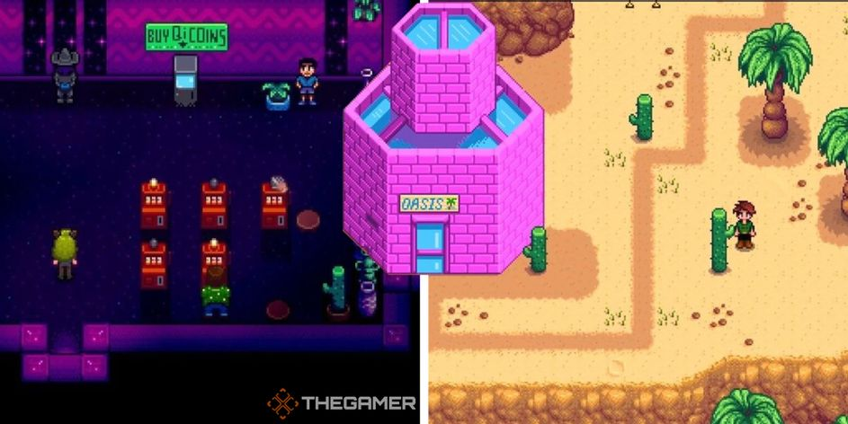

## The Desert

The Calico Desert is an exterior map region located far to the northwest of Pelican Town. The weather here is always sunny (even if it is raining everywhere else in Stardew Valley), and the seasons are all the same.

